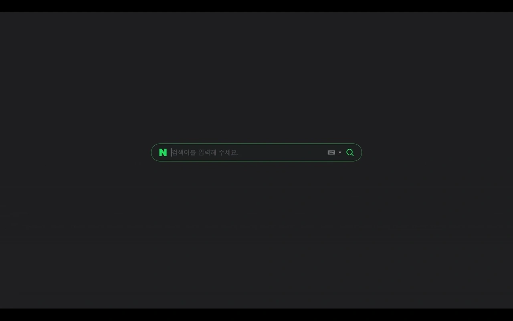

# Minaver

네이버([Naver](https://www.naver.com/))의 메인 화면을 미니멀하게 바꿔주는 사용자 스크립트입니다.  
초기 화면에서는 화면 중앙의 검색창만 표시되며, 마우스 스크롤 시 부드러운 애니메이션과 함께 전체 콘텐츠가 나타나 집중도를 높여줍니다.

  

---

## 주요 기능

* **미니멀한 시작 화면**: 네이버 접속 시 검색창 외의 모든 요소를 숨겨 깔끔한 화면 제공
* **부드러운 전환 애니메이션**: 마우스 휠 스크롤 시 원래의 네이버 화면으로 부드럽게 전환
* **애니메이션 속도 사용자 설정**: 스크립트 메뉴를 통해 전환 속도 조절 가능
* **Chrome 확장프로그램 지원**: `extension/` 폴더를 통해 확장프로그램으로도 설치 가능

---

## 설치 방법

### 사용자 스크립트

1. **사용자 스크립트 관리자 설치**  
   * [Violentmonkey](https://violentmonkey.github.io/)

2. **Minaver 스크립트 설치**  
   * [**스크립트 설치하기**](https://update.greasyfork.org/scripts/547954/Minaver.user.js)

### Chrome 확장프로그램

1. Chrome 주소창에 `chrome://extensions` 입력
2. 우측 상단 **개발자 모드** 활성화
3. **압축해제된 확장 프로그램을 로드합니다** 선택
4. 이 저장소의 `extension/` 폴더 선택

---

## 사용 방법

1. 스크립트 설치 후 [네이버](https://www.naver.com/) 접속
2. 검색창만 표시된 미니멀한 화면 확인
3. 아래로 스크롤 → 전체 콘텐츠와 함께 원래 화면으로 전환
4. 페이지 상단에서 위로 스크롤 → 다시 미니멀한 화면으로 전환

---

## 설정

### 사용자 스크립트

1. 브라우저 우측 상단 **스크립트 관리자 아이콘** 클릭
2. **'애니메이션 속도 설정'** 메뉴 선택
3. 원하는 속도(초 단위) 입력 → 기본값: `0.7`
4. 페이지 새로고침 시 변경 사항 적용

### Chrome 확장프로그램

1. 브라우저 우측 상단 **Minaver 확장 아이콘** 클릭
2. 원하는 속도(초 단위) 입력 → 기본값: `0.7`
3. **저장** 선택

---

## 라이선스

이 프로젝트는 **BSD 2-Clause License**를 따릅니다.  
자세한 내용은 `LICENSE` 파일 참고
